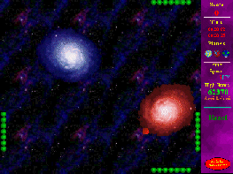



## Arvi's QUAD\-BALL A Must See\!

### Description

This Is A Fully Featured Game. IF YOU PROGRAM GAMES IN VB YOU MUST SEE THIS ! The aim of the game is to save earth (it is set in the future). This Game

Includes

Over 60 files, of which 25+ Contain vb-programming !!.

It Aslo Includes PicClp32 (ver. 6) For The Vb5 Users, So There Should Be

No Problems
 
### More Info
 

             |
---                |---
**Submitted On**   |1999-10-10 09:12:22
**By**             |[Arvinder Sehmi](https://github.com/Planet-Source-Code/PSCIndex/blob/master/ByAuthor/arvinder-sehmi.md)
**Level**          |Advanced
**User Rating**    |5.6 (882 globes from 157 users)
**Compatibility**  |VB 5\.0, VB 6\.0
**Category**       |[Games](https://github.com/Planet-Source-Code/PSCIndex/blob/master/ByCategory/games__1-38.md)
**World**          |[Visual Basic](https://github.com/Planet-Source-Code/PSCIndex/blob/master/ByWorld/visual-basic.md)
**Archive File**   |[CODE\_UPLOAD1243\.zip](https://github.com/Planet-Source-Code/arvinder-sehmi-arvi-s-quad-ball-a-must-see__1-3980/archive/master.zip)

